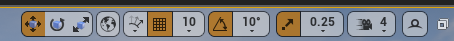
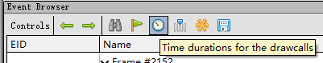
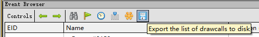
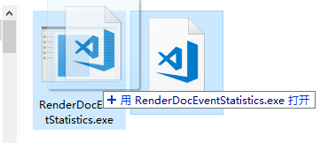
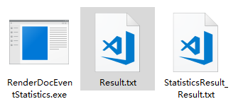
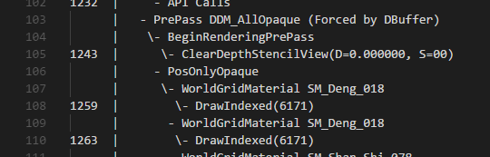
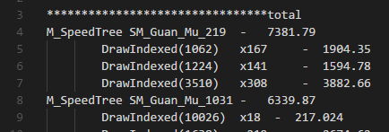

统计RenderDoc产生的Drawcall统计信息。
---

先将摄像机移动到需要抓帧的地方，点击右边最右边的小人头，调用RenderDoc抓帧。

在弹出的RenderDoc GUI中，选中刚刚抓的帧，并点击统计时间信息。

点击保存，导出为.txt格式的统计时间信息。

将导出的.txt文件拖动到RenderDocEventStatistics.exe上。

在原.txt文件的相同目录下，会产生一个StaticResult_xxx.txt的文件，即为统计结果。

原：

结果：

（PS：如果需要修改并重新编译，请使用VS2017的高版本